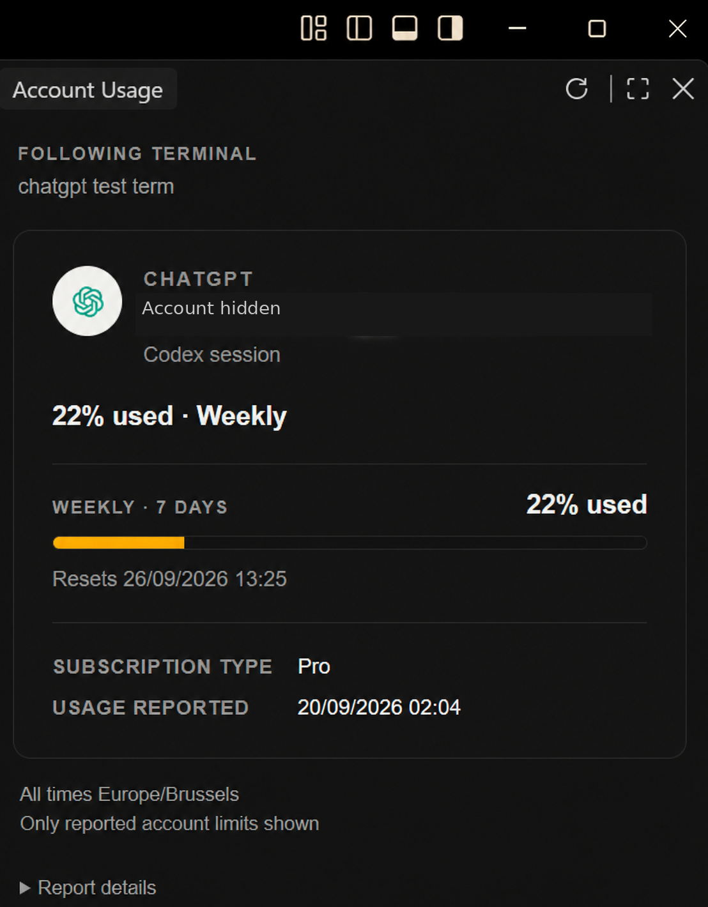
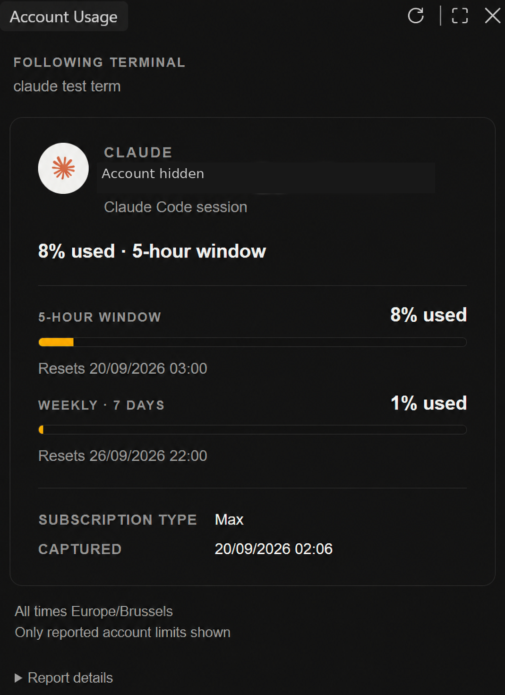
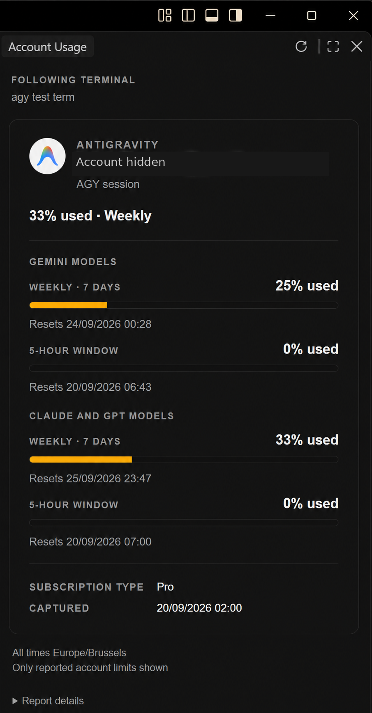

# Account Usage

Your AI account's quota, beside the terminal you're using.

Account Usage adds a card to VS Code's right sidebar. Switch terminals and the card follows the selected session's account: email, subscription type, quota bars and reset times. These are account limits, so usage can include other terminals and sessions. The active model is not used as the account identity.

| ChatGPT / Codex | Claude Code | Antigravity |
| --- | --- | --- |
|  |  |  |

Account emails are hidden in these screenshots.

## Install

1. Install [Account Usage from the VS Code Marketplace](https://marketplace.visualstudio.com/items?itemName=BlastworksAI.llm-oauth-acc-usage-indicator). For Remote-SSH, install it on the Linux SSH host.
2. Run **Account Usage: Open Card** and select your AI terminal.
3. For an unconnected supported terminal, click **Connect Codex**, **Connect Claude** or **Connect Antigravity** on the card. If safe process detection cannot name the provider, click **Connect Provider** and choose it. Check the profile and approve the connection.
4. Finish one fresh turn in that CLI. Its local adapter publishes the account and quota reading, and the card follows that session.

For manual installation, download the `.vsix` from [GitHub Releases](https://github.com/blastworksai/LLM-OAuth-Acc-Usage-Indicator/releases), then run **Extensions: Install from VSIX…** in VS Code.

Use an existing CLI login. The extension does not ask for passwords, API keys or tokens. It uses VS Code's own Node runtime; there is no separate Python or Node installation step.

## Supported tools and hosts

| CLI | Account usage shown | Connection |
| --- | --- | --- |
| Codex with a ChatGPT login | Reported account windows, reset times and subscription tier; current login email | Connect its user-level `Stop` hook |
| Claude Code | Reported five-hour and weekly windows; native login email and subscription tier when available | Connect its statusline |
| Antigravity (`agy`) | Gemini and GPT/Claude quota pools, each with five-hour and weekly windows when reported; native account email and tier | Connect its statusline and built-in quota reader |
| Kimi | Unsupported: upstream quota reports are currently unreliable | No numbers displayed |
| Muse and other CLIs | Unsupported | No numbers displayed |

The terminal host must run **Linux**. Desktop VS Code with Remote-SSH to Linux is the initial supported setup. Local Windows/macOS terminals, browser VS Code and cross-user `sudo` sessions are not covered by this release. WSL, Dev Containers and Codespaces are untested. A native provider process must be running in the selected terminal; common package-manager script launchers are supported by binding that exact process rather than guessing from terminal names. Provider setup requires the standard Linux shell and GNU-compatible core utilities.

## What the card means

- Percentages mean **used**. Antigravity's remaining percentages are converted once.
- Window labels follow their reported duration. A primary slot is not assumed to be a five-hour window.
- Dates use the timezone of the computer displaying VS Code, including when the terminal runs remotely.
- A missing or expired reading stays visibly unavailable. Unsupported pools are named, not silently represented as zero.
- Email is the current CLI login sampled with that session's fresh usage update.
- Subscription renewal/end dates are hidden when the CLI does not report them. A quota reset is not a subscription expiry.

Refreshing the card only rereads local reports; it sends no model prompt. After a Codex turn, the local hook calls native `account/read` (with refresh disabled) and `account/rateLimits/read`. Claude uses its statusline and native authentication status. Antigravity's idle statusline can run its built-in `/usage` command. None of these collection calls starts a model turn or adds text to model context.

## Setup and removal

The connection button names a safely detected, unconnected provider. When detection is unavailable, the card can offer **Connect Provider** and let you choose. It disappears after connection, including while the card waits for that session's first fresh turn, and is absent from populated cards. If a package update moves the running native CLI, the button returns so the saved connection can be reviewed and rebound. **Account Usage: Connect Provider** is also available in the Command Palette.

Setup shows the selected profile before changing provider configuration. For Codex it appends one user-level `Stop` hook and preserves every existing hook. For Claude and Antigravity it preserves and chains the existing statusline command. Package-manager launchers are resolved through the exact native provider process in the selected terminal rather than through a vendor-specific installation layout. If the CLI or one of its parent directories is controlled by another Linux owner or writable by a shared group, setup lists each exact path, owner, group and permission mode and offers **Trust and connect**. Approve only when you trust everyone who can replace that software. Detection has no hard-coded installation root or username; each approval is deliberately tied to the exact discovered metadata, and setup does not change permissions. Runtime files and sanitized reports stay in owner-controlled local storage, separate from editor installation files. Run **Account Usage: Disconnect Provider** before uninstalling; removing an extension cannot guarantee that provider settings are restored automatically.

See [setup and troubleshooting](docs/SETUP.md) and [privacy](docs/PRIVACY.md). When reporting an issue, remove emails, account identifiers, terminal names, paths and session IDs from screenshots and diagnostics.

## Development

```sh
npm ci
npm test
npm run package
```

The packaged VSIX is written to `artifacts/`. Its contents are allowlisted; development files, fixtures and local configuration are not shipped.

MIT licensed. Provider names and marks identify their respective services; this independent project is not affiliated with or endorsed by those providers. See [third-party notices](THIRD-PARTY-NOTICES.md).
